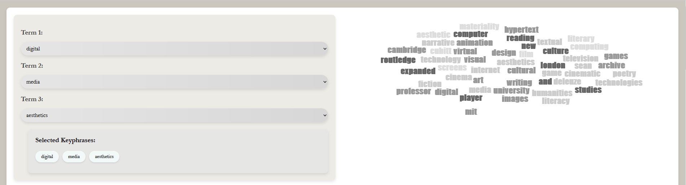
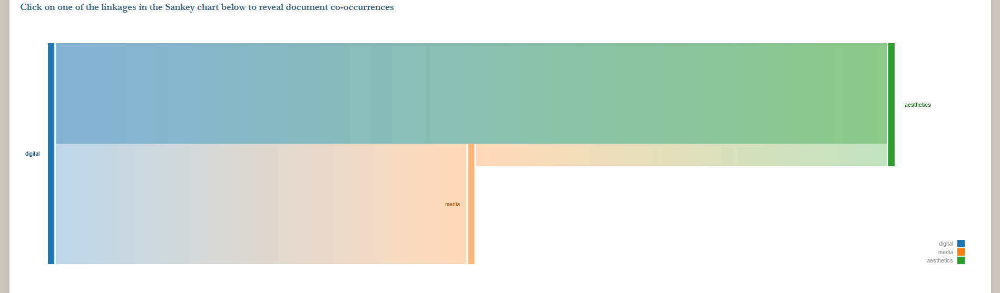
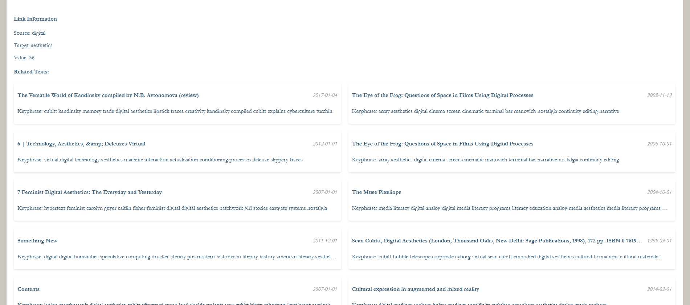

This is a create-react-app demo app for exploring keywords associated with documents in a Constellate dataset.

## Quickstart

### Starting the React app using example data included in repo
I used node 14.17.3 via NVM for package compatability. Would probably still work with another version if you use npm install --force

In the project directory, run:
`npm install`
`npm start`

The app will read from a default dataset saved in public/output.json

### Using your own data

1. Create a constellate dataset and download 'Sample metadata, ngrams, full-text (JSONL)'
2. Unzip the downloaded dataset and drop it into /dataUtils/constellateDatasets
3. In extract.js, rename `const inputFile` to match the name of the file to extract
4. If you haven't already, run npm install
5. from the terminal in directory /dataUtils, run node extract.js
6. Restructured data will now appear in /public/, ready be used in the React application via mock query

## About the dataset extractor
This will work with any constellate datasets that include `{ id, datePublished, keyphrase, sourceCategory, tdmCategory, title }`
does tfidf yadda yadda.

## Images

